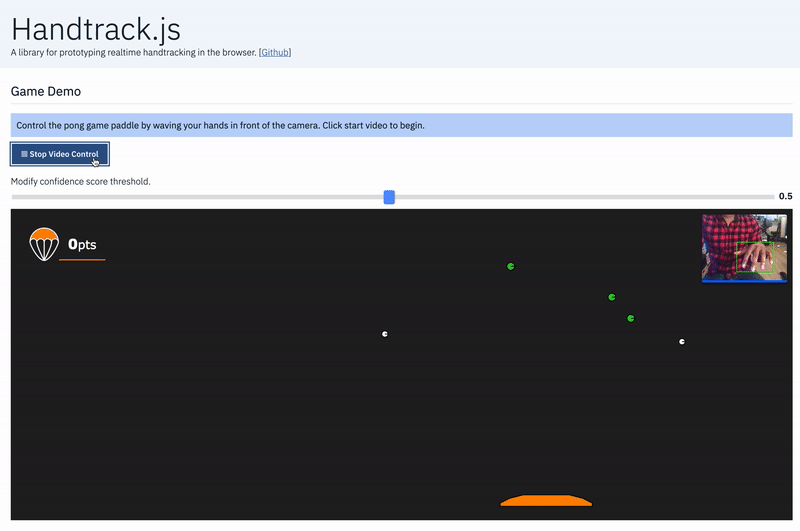

## Handtrack.js

[](https://badge.fury.io/js/handtrackjs)

[](https://www.jsdelivr.com/package/npm/handtrackjs)
 
> View a live demo in your [browser here](https://victordibia.github.io/handtrack.js/).


<!-- [](https://victordibia.github.io/handtrack.js/) -->

[](https://victordibia.github.io/handtrack.js/)

Handtrack.js is a library for prototyping realtime hand detection (bounding box), directly in the browser. It frames handtracking as an object detection problem, and uses a trained convolutional neural network to predict bounding boxes for the location of hands in an image. 

## Whats New? v0.1.x

Handtrack.js is currently being updated (mostly around optimizations for speed/accuracy and functionality). Here is a list of recent changes:

- **New dataset curation**: A  new dataset (~2000 images, 6000 labels) has been curated. The current version is focused on the viewpoint of a user facing a webcam. Details on data collection are listed below. Note that the dataset is not released (mostly because it contains personal information on the participants and effort is still underway to extract a subset that is free of PII). In the meantime, the project can be reproduced using the [egohands](http://vision.soic.indiana.edu/projects/egohands/) dataset which is public. 
- **New Classes**: Following a review of the use cases that developers have created so far with handtrack.js (e.g. game controls, detect face touching to minimize covid spread, air guitar etc), a new set of hand pose labels have been curated:
  - Open:  All fingers are extended in an open palm position.  This represents an open hand which can be the drop mode of a drag and drop operation.  
  - Closed: All fingers are contracted in a ball in a closed fist position. The closed hand is similar to the drag mode for a drag and drop operation.
  - Pinch: The thumb and index finger are are together in an picking gesture.  This can also double as a grab or drag mode in a drag and drop operation.
  - Point: Index finger is extended in a pointing gesture. 
  - Face: To help disambiguate between the face and hands, and to also enable face tracking applications in the same library, a face label is also added. 
  
- **Reduced Model size**: Handtrack.js now supports multiple models (e.g. ssd320fpnlite, ssd640fpnlite) with multiple sizes (large, medium and small). The large model is the FP32 version of the each model while medium and small are fp16 and Int8 quantized versions respectively. In my experiments, the small version yields comparable accuracy but with a much  small model weight size. Note that smaller models don't translate to faster - all three sizes yield about the same FPS. 
 
- **Model Accuracy**: Early testing shows the new model to be more accurate for the front facing web cam viewpoint detection. The inclusion of face labels also reduces the earlier face misclassifications 
- **Javascript Library**: The handtrack.js library has been updated to fix issues with correct input image resolutions, upgrade the underlying tensorflowjs models, provide more customization options (e.g. use of small medium or large base models etc) 


The underlying models are trained using the tensorflow object detection api ([see here](https://github.com/victordibia/handtracking/issues)).


| FPS | Image Size | Device                             | Browser                  | Comments |
|-----|------------|------------------------------------|--------------------------|----------|
| 26  | 450 * 380  | Macbook Pro (i7, 2.2GHz, 2018)     | Chrome Version 72.0.3626 |  --      |
| 14  | 450 * 380  | Macbook Pro (i7, 2.2GHz, mid 2014) | Chrome Version 72.0.3626 |  --      |


> This work is based on the [the coco-ssd tensorflowjs](https://github.com/tensorflow/tfjs-models/tree/master/coco-ssd) sample. Definitely check it out if you are interested in detecting/tracking any of the 90 classes in the coco dataset.

 

## Documentation

Handtrack.js is provided as a useful wrapper to allow you prototype hand/gesture based interactions in your web applications. without the need to understand machine learning. It takes in a html image element (`img`, `video`, `canvas` elements, for example) and returns an array of bounding boxes, class names and confidence scores. 
For details on documentation, please see the project documentation page here. 

[](https://victordibia.github.io/handtrack.js/)

## How does this work?
<!--  -->

- Trained using a dataset of annotated hand poses (open, closed, pointing, pinch ..) mostly captured from a user webcam viewpoint. This is also augmented with samples from other viewpoints (round table discussion participants, egocentric viewpoints) and varied lighting conditions. An earlier version of handtrack.js was trained with the egohands dataset.
- Trained model is converted to the Tensorflowjs webmodel format
- Model is wrapped into an npm package, and can be accessed using [jsdelivr](https://www.jsdelivr.com/package/npm/handtrackjs), a free open source cdn that lets you include any npm package in your web application. You may notice the model is loaded slowly the first time the page is opened but gets faster on subsequent loads (caching).

## When Should I Use Handtrack.js


If you are interested in prototyping gesture based (body as input) interactive experiences, Handtrack.js can be useful. The usser does not need to attach any additional sensors or hardware but can immediately take advantage of engagement benefits that result from gesture based and body-as-input interactions.



> Code examples for the pong game control shown above is in the [ `demo` folder](/demo).

Some (not all) relevant scenarios are listed below: 

- When mouse motion can be mapped to hand motion for control purposes.
- When an overlap of hand and other objects can represent meaningful interaction signals (e.g a touch or selection event for an object).
- Scenarios where the human hand motion can be a proxy for activity recognition (e.g. automatically tracking movement activity from a video or images of individuals playing chess). Or simply counting how many humans are present in an image or video frame.
- You want an accessible demonstration that anyone can easily run or tryout with minimal setup.
- You are interested in usecases that have offline, realtime, privacy requirements.


## How Do I Use Handtrack.js in my Web App?
 
### via Script Tag

You can use the library by including it in a javacript script tag.

```html

<!-- Load the handtrackjs model. -->
<script src="https://cdn.jsdelivr.net/npm/handtrackjs/dist/handtrack.min.js"> </script>

<!-- Replace this with your image. Make sure CORS settings allow reading the image! -->
 
<canvas id="canvas" class="border"></canvas>

<!-- Place your code in the script tag below. You can also use an external .js file -->
<script>
  // Notice there is no 'import' statement. 'handTrack' and 'tf' is
  // available on the index-page because of the script tag above.

  const img = document.getElementById('img'); 
  const canvas = document.getElementById('canvas');
  const context = canvas.getContext('2d');
  
  // Load the model.
  handTrack.load().then(model => {
    // detect objects in the image.
    model.detect(img).then(predictions => {
      console.log('Predictions: ', predictions); 
    });
  });
</script>
```

### via NPM

```shell
npm install --save handtrackjs
```

```js
import * as handTrack from 'handtrackjs';

const img = document.getElementById('img');

// Load the model.
handTrack.load().then(model => {
  // detect objects in the image.
  console.log("model loaded")
  model.detect(img).then(predictions => {
    console.log('Predictions: ', predictions); 
  });
});
```


## API

####  Loading the model: handTrack.load()
Once you include the js module, it is available as `handTrack`. You can then load a model with optional parameters.

```js

const modelParams = {
  flipHorizontal: true,   // flip e.g for video 
  imageScaleFactor: 0.7,  // reduce input image size for gains in speed.
  maxNumBoxes: 20,        // maximum number of boxes to detect
  iouThreshold: 0.5,      // ioU threshold for non-max suppression
  scoreThreshold: 0.79,    // confidence threshold for predictions.
}

handTrack.load(modelParams).then(model => {

});

```
Returns a `model` object.

#### Detecting hands: model.detect()
`model.detect` takes an input image element (can be an `img`, `video`, `canvas` tag) and returns an array of bounding boxes with class name and confidence level.

```js
model.detect(img).then(predictions => { 
        
});
```

Returns an array of classes and confidence scores that looks like:

```js
[
    {
        "class": 2,
        "label": "closed",
        "score": "0.71",
        "bbox": [
            170.54356634616852,
            68.90409886837006,
            204.50245141983032,
            213.6879175901413
        ]
    }
]
```

#### Other Helper Methods

- `model.getFPS()` : get FPS calculated as number of detections per second.
- `model.renderPredictions(predictions, canvas, context, mediasource)`:  draw bounding box (and the input mediasource image) on the specified canvas. `predictions` are an array of results from the `detect()` method. `canvas` is a reference to a html canvas object where the predictions should be rendered, `context` is the canvas 2D context object, `mediasource` a reference to the input frame (img, video, canvas etc) used in the prediction (it is first rendered, and the bounding boxes drawn on top of it).
- `model.getModelParameters()`: returns model parameters.
- `model.setModelParameters(modelParams)`: updates model parameters with [`modelParams`](#loading-the-model-handtrackload)
- `dispose()` : delete model instance
- `startVideo(video)` : start webcam video stream on given video element. Returns a promise that can be used to validate if user provided video permission.
- `stopVideo(video)` : stop video stream.

## Run Demo 

Commands below runs the demo example in the `demo` folder.

`npm install`
`npm run start`

The start script launches a simple `python3` webserver from the demo folder using `http.server`. You should be able to view it in your browser at [http://localhost:3005/](http://localhost:3005/). You can also view the pong game control demo on same link [http://localhost:3005/pong.html](http://localhost:3005/pong.html)


## Citing this Work ([see abstract](https://github.com/victordibia/handtracking/tree/master/docs/handtrack.pdf))


> Paper abstract of the [paper is here](https://github.com/victordibia/handtracking/tree/master/docs/handtrack.pdf). (a full paper will be added when complete).

If you use this code in your project/paper/research and would like to cite this work, use the below.

Victor Dibia, HandTrack: A Library For Prototyping Real-time Hand TrackingInterfaces using Convolutional Neural Networks, https://github.com/victordibia/handtracking

```bib
@article{Dibia2017,
  author = {Victor, Dibia},
  title = {HandTrack: A Library For Prototyping Real-time Hand TrackingInterfaces using Convolutional Neural Networks},
  year = {2017},
  publisher = {GitHub},
  journal = {GitHub repository},
  url = {https://github.com/victordibia/handtracking/tree/master/docs/handtrack.pdf}, 
}
```

## TODO (ideas welcome)

- [ ] Optimization: This thing is still compute heavy (your fans may spin after while). This is mainly because of the neural net operations needed to predict bounding boxes. I am currently exploring CenterNets (an anchor free object detection model) as one way to minimize compute requirements.

- [ ] Tracking id's across frames. Perhaps some nifty methods that assigns ids to each had as they enter a frame and tracks them (e.g based on naive euclidean distance).

- [x] Add some discrete poses (e.g. instead of just hand, detect open hand, closed, ).

