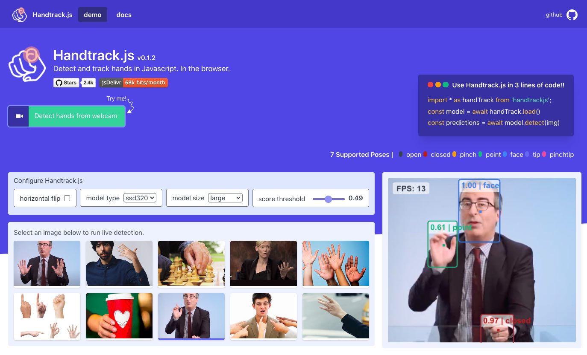
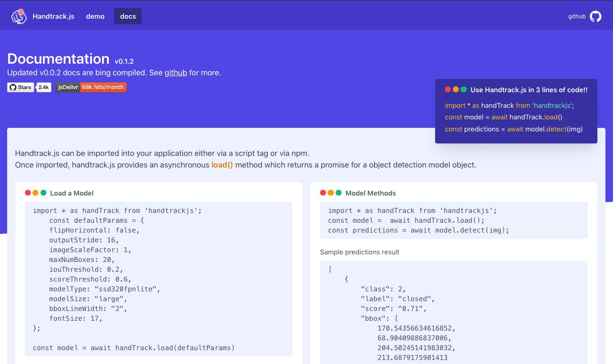
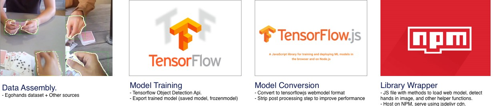

## Handtrack.js

[](https://badge.fury.io/js/handtrackjs)

[](https://www.jsdelivr.com/package/npm/handtrackjs)
 
> View a live demo in your [browser here](https://victordibia.github.io/handtrack.js/).


<!-- [](https://victordibia.github.io/handtrack.js/) -->

[](https://victordibia.github.io/handtrack.js/)

> Note: 
Version `0.0.13` is the old version of handtrack.js which tracks only hands and was trained on the egohands dataset. It is slightly more stable than the recent version v `0.1.x` which is trained on a new dataset (still in active development) and supports more classes (open, closed, pinch, point, zoom etc.). You might see some issues with the new version (feel free to downgrade to `0.0.13` as needed) and also report the issues you see.

Handtrack.js is a library for prototyping realtime hand detection (bounding box), directly in the browser. It frames handtracking as an object detection problem, and uses a trained convolutional neural network to predict bounding boxes for the location of hands in an image. 

## Whats New? v0.1.x

Handtrack.js is currently being updated (mostly around optimizations for speed/accuracy and functionality). Here is a list of recent changes:

- **New dataset curation**: A  new dataset (~2000 images, 6000 labels) has been curated to cover new hand poses (discussed below) and focuses on the viewpoint of a user facing a webcam. Note that the dataset is not released (mostly because it contains personal information on the participants and effort is still underway to extract a subset that is free of PII). In the meantime, the project can still be reproduced using the [egohands](http://vision.soic.indiana.edu/projects/egohands/) dataset which is public. 
- **New Classes**: Following a review of the use cases that developers have created so far with handtrack.js (e.g. game controls, detect face touching to minimize covid spread, air guitar etc), a new set of hand pose labels have been curated:
  - Open:  All fingers are extended in an open palm position.  This represents an open hand which can be the drop mode of a drag and drop operation.  
  - Closed: All fingers are contracted in a ball in a closed fist position. The closed hand is similar to the drag mode for a drag and drop operation.
  - Pinch: The thumb and index finger are are together in an picking gesture.  This can also double as a grab or drag mode in a drag and drop operation.
  - Point: Index finger is extended in a pointing gesture. 
  - Face: To help disambiguate between the face and hands (a failure point for the previous version of handtrack.js), and to also enable face tracking applications in the same library, a face label has been added. 
  
- **Reduced Model size**: Handtrack.js now supports multiple models (e.g. ssd320fpnlite, ssd640fpnlite) with multiple sizes (large, medium and small). The large size is the default fp32 version of the each model while medium and small are fp16 and Int8 quantized versions respectively. In my experiments, the small version yields comparable accuracy but with a much  smaller model weight size.  For example, ssd320fpnlite sizes (large -> 12MB, medium -> 6MB, small -> 3MB!)

> Note that smaller models don't translate to faster inference speed - all three sizes yield about the same FPS.

 
- **Model Accuracy**: Early testing shows the new model to be more accurate for the front facing web cam viewpoint detection. The inclusion of face labels also reduces the earlier face misclassifications 
- **Javascript Library**: The handtrack.js library has been updated to fix issues with correct input image resolutions, upgrade the underlying tensorflowjs models, provide more customization options (e.g. use of small medium or large base models etc) 


The underlying models are trained using the tensorflow object detection api ([see here](https://github.com/victordibia/handtracking/issues)).


| FPS | Image Size | Device                             | Browser                  | Comments |
|-----|------------|------------------------------------|--------------------------|----------|
| 26  | 450 * 380  | Macbook Pro (i7, 2.2GHz, 2018)     | Chrome Version 72.0.3626 |  --      |
| 14  | 450 * 380  | Macbook Pro (i7, 2.2GHz, mid 2014) | Chrome Version 72.0.3626 |  --      |


> Note: Handtrack.js has not been extensively tested on mobile browsers. There have been some known inconsistencies still being investigated.

 

## Documentation

Handtrack.js is provided as a useful wrapper to allow you prototype hand/gesture based interactions in your web applications. without the need to understand machine learning. It takes in a html image element (`img`, `video`, `canvas` elements, for example) and returns an array of bounding boxes, class names and confidence scores. 

### Import the Handtrack.js Library

> Note that the current version of the handtrack.js library is designed to work in the browser (frontend Javascript) and not Node.js. 
> 
Handtrack.js can be imported into your application either via a  `script tag` or via `npm`.
Once imported, handtrack.js provides an asynchronous `load(`) method which returns a promise for a object detection `model` object.

#### Import via Script Tag

 
```html

<!-- Load the handtrackjs model. -->
<script src="https://cdn.jsdelivr.net/npm/handtrackjs@latest/dist/handtrack.min.js"> </script>

<!-- Replace this with your image. Make sure CORS settings allow reading the image! -->
  

<!-- Place your code in the script tag below. You can also use an external .js file -->
<script>
  const img = document.getElementById('img'); 
  const model =  await handTrack.load();
  const predictions = await model.detect(img); 
</script>
```

#### via NPM

```shell
npm install --save handtrackjs
```

```js
import * as handTrack from 'handtrackjs';

const img = document.getElementById('img'); 
const model =  await handTrack.load();
const predictions = await model.detect(img); 
```

Handtrack.js also proivdes a set of library helper methods (e.g. to start and stop video playback on a video element) and some model methods (e.g. `detect`, `getFPS` etc). Please see the project documentation page for more details on the API and examples. 

[](https://victordibia.github.io/handtrack.js/)

## How does Handtrack.js Work?
<!--  -->

- Trained using a dataset of annotated hand poses (open, closed, pointing, pinch ..) mostly captured from a user webcam viewpoint. This is also augmented with samples from other viewpoints (round table discussion participants, egocentric viewpoints) and varied lighting conditions. An earlier version of handtrack.js was trained with the egohands dataset.
- Trained model is converted to the Tensorflowjs webmodel format
- Model is wrapped into an npm package, and can be accessed using [jsdelivr](https://www.jsdelivr.com/package/npm/handtrackjs), a free open source cdn that lets you include any npm package in your web application. You may notice the model is loaded slowly the first time the page is opened but gets faster on subsequent loads (caching).

## When Should I Use Handtrack.js
 

If you are interested in prototyping gesture based (body as input) interactive experiences, Handtrack.js can be useful. The user does not need to attach any additional sensors or hardware but can immediately take advantage of engagement benefits that result from gesture based and body-as-input interactions.
 

Some (not all) relevant scenarios are listed below: 

- When mouse motion can be mapped to hand motion for control purposes.
- When an overlap of hand and other objects can represent meaningful interaction signals (e.g a touch or selection event for an object).
- Scenarios where the human hand motion can be a proxy for activity recognition (e.g. automatically tracking movement activity from a video or images of individuals playing chess). Or simply counting how many humans are present in an image or video frame.
- You want an accessible demonstration that anyone can easily run or tryout with minimal setup.
- You are interested in usecases that have offline, realtime, privacy requirements.


### Limitations

The main limitation currently is that handtrack.js is still a fairly heavy model and there have been some inconsistent results when run on mobile.

## Run Demo 

Commands below runs the demo example in the `demo` folder.

```javascript 
npm install
npm run start
```

The start script launches a simple `python3` webserver from the demo folder using `http.server`. You should be able to view it in your browser at [http://localhost:3005/](http://localhost:3005/). You can also view the pong game control demo on same link [http://localhost:3005/pong.html](http://localhost:3005/pong.html)


## Citing this Work ([see abstract](https://github.com/victordibia/handtracking/tree/master/docs/handtrack.pdf))


> Paper abstract of the [paper is here](https://github.com/victordibia/handtracking/tree/master/docs/handtrack.pdf). (a full paper will be added when complete).

If you use this code in your project/paper/research and would like to cite this work, use the below.

Victor Dibia, HandTrack: A Library For Prototyping Real-time Hand TrackingInterfaces using Convolutional Neural Networks, https://github.com/victordibia/handtracking

```bib
@article{Dibia2017,
  author = {Victor, Dibia},
  title = {HandTrack: A Library For Prototyping Real-time Hand TrackingInterfaces using Convolutional Neural Networks},
  year = {2017},
  publisher = {GitHub},
  journal = {GitHub repository},
  url = {https://github.com/victordibia/handtracking/tree/master/docs/handtrack.pdf}, 
}
```

## TODO (ideas welcome)

- [ ] Optimization: This thing is still compute heavy (your fans may spin after while). This is mainly because of the neural net operations needed to predict bounding boxes. I am currently exploring CenterNets (an anchor free object detection model) as one way to minimize compute requirements.

- [ ] Tracking id's across frames. Perhaps some nifty methods that assigns ids to each had as they enter a frame and tracks them (e.g based on naive euclidean distance).

- [x] Add some discrete poses (e.g. instead of just hand, detect open hand, closed, ).

