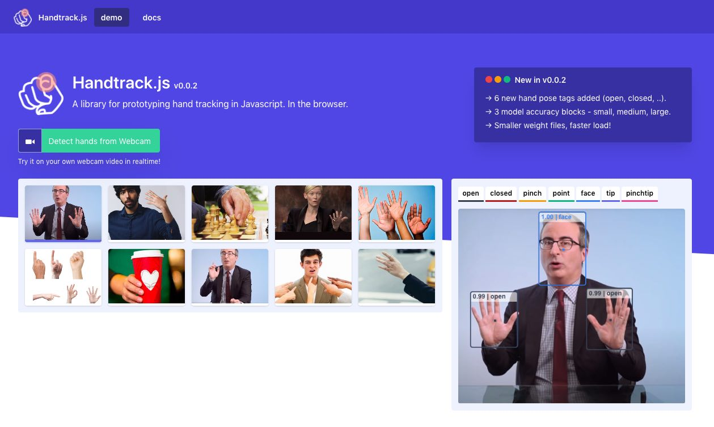
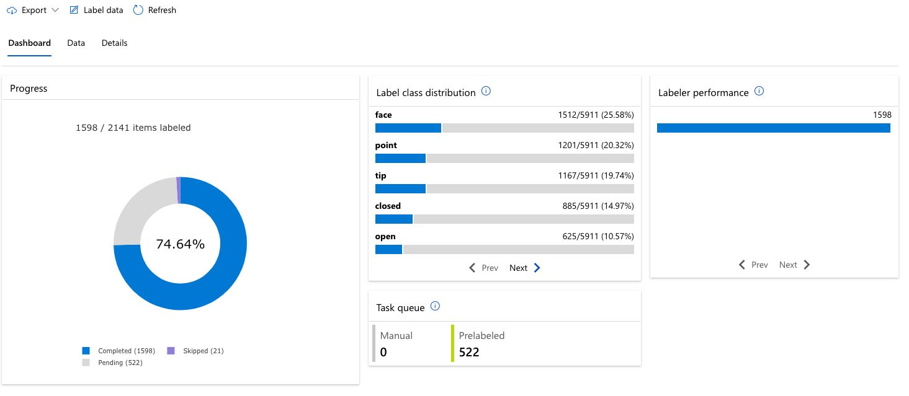

## Handtrack.js
Existing research suggest that exploring the use of the human body (e.g. hands) as an input device can lead to more natural interaction and increased engagement. However, most systems that implement so called "body as input device" often require custom sensor and SDKs that are challenging to integrate with widely used (but resource constrained) environments like the browser. The focus on the browser, and javascript is particularly important as Javascript continues to be the most accessible and most widely used language according the [2020 github octoverse](https://octoverse.github.com/) survey.

Handtrack.js aims to address this issue by providing a purely javascript library that web developers (or designers) can use in implementing detecting hands within images. It provides as a useful wrapper to allow you prototype hand/gesture based interactions in your web applications without the need to understand the underlying machine learning models. It takes in a html image element (img, video, canvas elements) and returns an array of bounding boxes, class names and confidence scores.

The library also provides some useful functions (e.g renderPredictions to draw bounding boxes on a canvas element, startVideo to initialize video capture in the browser), and customizable model parameters. 

### New Version of Handtrack.js - What is New?

An earlier version of handtrack.js was created before this hackathon which has been significantly revised. 
Below are some limitations of the previous version which have now been addressed:

- **Dataset**: The previous version of handtrack.js was trained using the Egohands dataset (4800 images). This dataset contained polygon annotations of hands (converted to bounding boxes) captured from an egocentric viewpoint (user wearing a Google glass headset and recording their point of view). An important challenge here is that this dataset does properly cover the viewpoint of a user facing a webcam (the primary viewpoint in a desktop machine).
- **Hand pose labels**: The previous version of handtrack.js only provided a single hand label - hand. It did not distinguish between any canonical set of hand positions (e.g. open, closed, pointing etc). While understanding the location of hands is already useful, it is challenging to prototype control sequences with only a single state.
- **Model load time**: The previous model weights were 18.5mb sharded across 5 files. Loading these files incurred some delay which 
- **Model accuracy**: The previous model struggle to distinguish between faces and hands. Given that there were no annotations on face, the model just does not have sufficient discriminant signal to correctly separate face from other labels.

Below are a key list of updates that have been implemented as part of this hackathon:

- **New dataset curation**: A completely new dataset (~2000 images, 6000 labels) has been curated. The current version is focused on the viewpoint of a user facing a webcam. Details on data collection are listed below. Note that the dataset is not released (mostly because it contains personal information on the participants and effort is still underway to extract a subset that is free of PII).
- **New labels**: Following extensive review of the usecases for an earlier version of handtrack.js (e.g. game controls, detect face touching to minimize covid spread etc), a new set of hand pose labels have been curated:
  - Open:  All fingers are extended in an open palm position.  This represents an open hand which can be the drop mode of a drag and drop operation.  
  - Closed: All fingers are contracted in a ball in a closed fist position. The closed hand is similar to the drag mode for a drag and drop operation.
  - Pinch: The thumb and index finger are are together in an picking gesture.  This can also double as a grab or drag mode in a drag and drop operation.
  - Point: Index finger is extended in a pointing gesture. 
  - Face: To help disambiguate between the face and hands, and to also enable face tracking applications in the same library, a face label is also added. 
- **Reduced Model size**: In this version, experiments are conducted with multiple object detection model architectures (SSD FPN lite, CenterNets, EfficientDet) and with multiple input image sizes. Currently an SSD MobileNet v2, FPN lite model with input size 320x320px is being used and results in a model size of 12MB. Further, this model has been fp16 and int8 quantized with comparable results yield model sizes of  7MB and 3MB respectively. This results in an overall faster load time and better user experience.
- **Accuracy**: Early testing shows the new model to be more accurate for the front facing web cam viewpoint detection.

## Azure ML

Azure Machine Learning is used to enable the handtrack.js workflow in the following ways: 

- **ML Assisted Data Labeling**:  The Azure ML data labeling tool is used to label > 2000 images.
- **Azure AutoML**: This feature is is used to rapidly train an early version of the model which is used in prelabelling images and also used in finetuning the data collection process.
- **Azure ML Notebooks**: Are used to train multiple versions of the model, and export model targets in python and javascript for use in handtrack.js.

## How we built it

Handtrack.js frames the task of detecting/tracking hands as an object detection problem (for a given image, predict a the bounding box location of objects and their class names).  Consequently, object detection models are explored in solving the task. The high level overview of the process is structured as follows:

- Data Collection: Processes for data collection and annotation. 
- Model Training: Pipeline for training a set of object detection model architectures (e.g. ).
- Model Evaluation: Pipeline for comparatively evaluating all of the trained model architectures 
- Model Export: Pipeline to export each model first export the trained model checkpoints to the Tensorflow Saved Model Format (Python) and then to quantize the models and export to  Tensorflow.js web model format. 
- Library Design, Testing: The model is rolled into a javascript library which is bundled using parcel.js.  A set of tests and [demos](https://victordibia.com/handtrack.js/#/) are then used to rigorously test out the capabilities of library.

## Challenges we ran into

## Accomplishments that we're proud of

- Solving Tensorflow API versionissues required to successfully convert object detection models from checkpoints to javascript web model format.
- Creating an automated pipeline to enable low touch model retraining.  
    - New videos are added to a storage bucket
    - Train sample generator. Converts videos into videos at 2 frames per second. 
        - Each frame is then written to an azure bucket 
    - Azure labeller automatically monitors this bucket for new data points and survaces them for labelling 
    - Script fetches label json from ML azure 
    - Labelled data is converted into train test, validation sets and written to a bucket
    - Train/test/validation is converted into Tensorflow records .. the format required for use with the Tensorflow object detection model and written to a storage bucket
    - Model training scripts use these output files to automatically train multiple model sizes . Currently the focus is on ssdMobileNet320fpnlite, ssdMobileNet640fipnlite, efficientdet512d0, and CenterNetMobileNet512.
    - Automatic eval script evaluates the produced checkpoints 
    - Model export .. converts each of these saved model files to Tensorflow.js compatible models which can be used in the browser.
- Creating a complete new dataset to to support a new set of hand poses. Currently this includes  … .Data collection will be continuous (and possible due to the automated pipeline above) with the goal of addressing observed deficits in tracking as the model is used. 

## What we learned

## What's next for Handtrack.js 1.0 : Real Time Handtracking in the Browser
- Further model optimization. The current best performing model in the benchmark (ssd mobilenet fpnlite 320) is still not fast enough. While usable at ~10 FPS on a 2018 macbook pro, a 30 FPS frame rate is the current target. To achieve this, a few things are being done
  - Revise the current model graph e.g. extract non max suppression ops from the model graph and perform that on CPU backend instead of GPU shaders
  - Explore CenterNets - an anchor free object detection model model architecture which is faster. 